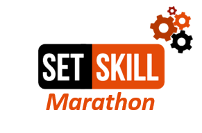

<!-- PROJECT LOGO -->
 

  

<!-- SET-SKILL PROGRAMMING -->
## Set-Skill Programming  

### Marathon  
#### Day 3  

- Methods with parameters
- while loop
- program exit block
- `.equals()` vs `==`
- Sample menu logic

<!-- CONTACT -->
## Contact

Edward Kats - [@kats.edward](https://www.instagram.com/kats.edward/) 
